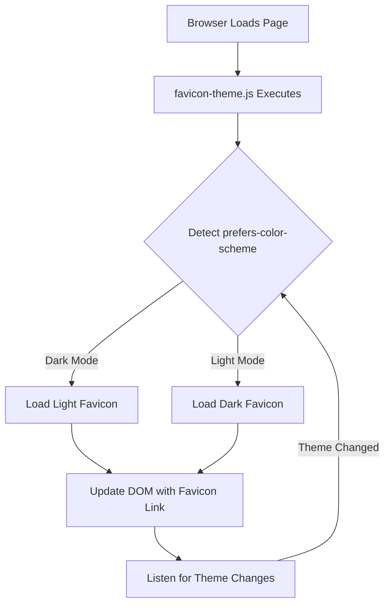

# Adaptive Favicon Feature - Design Document

## Overview

This design implements an adaptive favicon system that automatically switches between light and dark mode favicons based on the user's browser/system theme preference. The solution uses a JavaScript-based approach with `prefers-color-scheme` media query detection to dynamically update favicon links in the HTML head.

**Current State**: A partial implementation exists in `public/favicon-theme.js`, but it references incorrect file paths (`/Dark-Light%20logo/` directory that doesn't exist). The actual logo files are located in `/public/images/`. This design addresses the bugs in the current implementation and ensures the feature works correctly.

## Architecture

The adaptive favicon system consists of three main components:

1. **Favicon Assets**: SVG and PNG favicon files optimized for both light and dark themes
2. **Theme Detection Script**: JavaScript module that detects system theme preference and updates favicon dynamically
3. **HTML Integration**: Link tags in index.html that reference the theme detection script and provide fallbacks

### Architecture Diagram



## Components and Interfaces

### 1. Favicon Assets

**Location**: `/public/`

**Files**:
- `favicon-light.svg` - Light-colored logo for dark mode (already exists)
- `favicon-dark.svg` - Dark-colored logo for light mode (already exists)
- `favicon-16x16.png` - 16x16 PNG fallback (already exists)
- `favicon-32x32.png` - 32x32 PNG fallback (already exists)
- `favicon.ico` - ICO fallback for legacy browsers (already exists)

**Asset Requirements**:
- SVG files should be optimized and minified
- PNG files should use appropriate compression
- All files should be under 10KB for optimal performance

### 2. Theme Detection Script

**File**: `/public/favicon-theme.js`

**Current Implementation Analysis**:
The existing script has several issues:
- References non-existent `/Dark-Light%20logo/` directory
- Uses polling (setInterval) which is inefficient
- Has excessive console logging
- Doesn't properly handle all edge cases

**Improved Interface**:

```javascript
interface FaviconThemeManager {
  // Initialize the favicon system
  init(): void;
  
  // Update favicon based on current theme
  updateFavicon(isDarkMode: boolean): void;
  
  // Get current theme preference
  getCurrentTheme(): 'light' | 'dark';
  
  // Clean up event listeners
  destroy(): void;
}
```

**Key Functions**:

1. `getCurrentTheme()`: Detects system theme using `window.matchMedia('(prefers-color-scheme: dark)')`
2. `updateFavicon(isDarkMode)`: Removes existing favicon links and adds new one based on theme
3. `init()`: Sets up initial favicon and registers theme change listeners
4. `destroy()`: Cleanup function for removing event listeners

### 3. HTML Integration

**File**: `/index.html`

**Structure**:
```html
<head>
  <!-- Theme-aware favicon script - loads first -->
  <script src="/favicon-theme.js"></script>
  
  <!-- Fallback favicons for browsers without JS -->
  <link rel="icon" type="image/svg+xml" href="/favicon-dark.svg" />
  <link rel="icon" type="image/png" sizes="32x32" href="/favicon-32x32.png" />
  <link rel="icon" type="image/png" sizes="16x16" href="/favicon-16x16.png" />
  <link rel="shortcut icon" href="/favicon.ico" />
</head>
```

## Data Models

### Theme State

```typescript
type ThemeMode = 'light' | 'dark';

interface FaviconConfig {
  light: {
    svg: string;      // Path to dark-colored favicon for light mode
    png32: string;    // PNG fallback 32x32
    png16: string;    // PNG fallback 16x16
  };
  dark: {
    svg: string;      // Path to light-colored favicon for dark mode
    png32: string;    // PNG fallback 32x32
    png16: string;    // PNG fallback 16x16
  };
  fallback: string;   // ICO fallback for legacy browsers
}
```

### Configuration Object

```javascript
const FAVICON_CONFIG = {
  light: {
    svg: '/favicon-dark.svg',
    png32: '/favicon-32x32.png',
    png16: '/favicon-16x16.png'
  },
  dark: {
    svg: '/favicon-light.svg',
    png32: '/favicon-32x32.png',  // Should be light version
    png16: '/favicon-16x16.png'   // Should be light version
  },
  fallback: '/favicon.ico'
};
```

## Correctness Properties

*A property is a characteristic or behavior that should hold true across all valid executions of a system—essentially, a formal statement about what the system should do. Properties serve as the bridge between human-readable specifications and machine-verifiable correctness guarantees.*

### Property 1: Theme Detection Accuracy
*For any* browser that supports `prefers-color-scheme`, when querying the current theme preference, the system should return 'dark' if dark mode is enabled and 'light' if light mode is enabled.

**Validates: Requirements AC-1.1**

### Property 2: Correct Favicon Selection
*For any* detected theme state (light or dark), the favicon path selected should be the light-colored version when dark mode is active and the dark-colored version when light mode is active.

**Validates: Requirements AC-1.2, AC-2.1**

### Property 3: DOM-based Update Without Reload
*For any* theme change, the favicon update should modify the DOM directly by manipulating link elements, without triggering page navigation or reload.

**Validates: Requirements AC-1.3**

### Property 4: Real-time Event Response
*For any* theme change event triggered by the browser, the favicon update function should be called and complete within 100ms.

**Validates: Requirements AC-3.1**

### Property 5: Error-free Theme Switching
*For any* sequence of theme change operations, no JavaScript errors or exceptions should be thrown during the favicon update process.

**Validates: Requirements AC-3.4**

### Property 6: DOM Manipulation Idempotence
*For any* sequence of theme changes, the DOM should contain exactly one favicon link element after each update, with no duplicate or orphaned link elements.

**Validates: Requirements AC-3.2**

## Error Handling

### Error Scenarios

1. **Missing Favicon Files**
   - **Detection**: Check if favicon files exist during build/deployment
   - **Handling**: Fall back to default favicon.ico
   - **User Impact**: Minimal - default favicon still displays

2. **Browser Doesn't Support prefers-color-scheme**
   - **Detection**: Check `window.matchMedia` availability
   - **Handling**: Use default dark favicon
   - **User Impact**: No adaptive behavior, but favicon still works

3. **JavaScript Disabled**
   - **Detection**: N/A (script won't run)
   - **Handling**: Static fallback links in HTML
   - **User Impact**: No adaptive behavior, default favicon displays

4. **Theme Change Event Listener Failure**
   - **Detection**: Try-catch around event listener registration
   - **Handling**: Log error silently, continue with initial theme
   - **User Impact**: Favicon won't update on theme change until page reload

5. **DOM Manipulation Errors**
   - **Detection**: Try-catch around DOM operations
   - **Handling**: Retry once, then fail silently
   - **User Impact**: Favicon may not update, but page remains functional

### Error Handling Strategy

```javascript
function safeUpdateFavicon(isDarkMode) {
  try {
    // Remove existing favicons
    const existingFavicons = document.querySelectorAll('link[rel*="icon"]');
    existingFavicons.forEach(link => link.remove());
    
    // Add new favicon
    const link = document.createElement('link');
    link.rel = 'icon';
    link.type = 'image/svg+xml';
    link.href = isDarkMode ? FAVICON_CONFIG.dark.svg : FAVICON_CONFIG.light.svg;
    
    document.head.appendChild(link);
  } catch (error) {
    // Silent failure - don't break the page
    console.error('Failed to update favicon:', error);
  }
}
```

## Testing Strategy

### Unit Tests

Unit tests will verify specific examples and edge cases:

1. **Theme Detection Tests**
   - Test with dark mode enabled
   - Test with light mode enabled
   - Test with no preference set
   - Test with unsupported browser

2. **Favicon Update Tests**
   - Test favicon link is created correctly
   - Test old favicon links are removed
   - Test correct file path is used
   - Test SVG type is set correctly

3. **Event Listener Tests**
   - Test listener is registered on init
   - Test listener responds to theme changes
   - Test listener cleanup on destroy

### Property-Based Tests

Property-based tests will verify universal properties across randomized inputs using the `fast-check` library (already in package.json). Each test should run a minimum of 100 iterations.

1. **Property Test: Theme Detection Accuracy**
   - **Feature: adaptive-favicon, Property 1**: Theme detection accuracy
   - Generate random matchMedia mock states (dark: true/false)
   - Verify getCurrentTheme() returns 'dark' when dark mode enabled, 'light' otherwise
   - Validates: Requirements AC-1.1

2. **Property Test: Correct Favicon Selection**
   - **Feature: adaptive-favicon, Property 2**: Correct favicon selection
   - Generate random theme states (light/dark)
   - Verify light-colored favicon path is selected for dark mode
   - Verify dark-colored favicon path is selected for light mode
   - Validates: Requirements AC-1.2, AC-2.1

3. **Property Test: DOM-based Update Without Reload**
   - **Feature: adaptive-favicon, Property 3**: DOM-based update without reload
   - Generate random theme changes
   - Verify updateFavicon modifies DOM (link elements)
   - Verify no navigation events are triggered
   - Validates: Requirements AC-1.3

4. **Property Test: Real-time Event Response**
   - **Feature: adaptive-favicon, Property 4**: Real-time event response
   - Generate random theme change events
   - Measure time from event to DOM update completion
   - Verify update completes within 100ms
   - Validates: Requirements AC-3.1

5. **Property Test: Error-free Theme Switching**
   - **Feature: adaptive-favicon, Property 5**: Error-free theme switching
   - Generate random sequences of theme changes (including rapid switches)
   - Verify no JavaScript errors or exceptions are thrown
   - Validates: Requirements AC-3.4

6. **Property Test: DOM Idempotence**
   - **Feature: adaptive-favicon, Property 6**: DOM manipulation idempotence
   - Generate random sequences of theme changes
   - After each update, verify exactly one favicon link element exists
   - Verify no duplicate or orphaned link elements
   - Validates: Requirements AC-3.2

### Integration Tests

Integration tests will verify the complete system:

1. **End-to-End Theme Switching**
   - Load page in light mode
   - Verify dark favicon is displayed
   - Switch to dark mode
   - Verify light favicon is displayed
   - Validates: Requirements AC-1.1, AC-1.2, AC-2.1, AC-3.1

2. **Multi-tab Behavior**
   - Open multiple tabs
   - Change system theme
   - Verify all tabs update (may require manual testing)
   - Validates: Requirements AC-3.3

3. **Fallback Behavior**
   - Test with JavaScript disabled
   - Verify static favicon displays
   - Validates: Requirements AC-4.5

### Browser Compatibility Testing

Manual testing required for:
- Chrome (latest)
- Firefox (latest)
- Safari (latest)
- Edge (latest)
- Mobile browsers (iOS Safari, Chrome Mobile)

### Performance Testing

1. **Load Time Impact**
   - Measure page load time with and without favicon script
   - Verify impact is < 10ms
   - Validates: Requirements TR-4

2. **Memory Usage**
   - Monitor memory usage during theme switches
   - Verify no memory leaks from event listeners
   - Validates: Requirements TR-4

## Implementation Notes

### Browser Compatibility

**Supported Browsers**:
- Chrome 76+ (prefers-color-scheme support)
- Firefox 67+
- Safari 12.1+
- Edge 79+

**Fallback for Older Browsers**:
- Static favicon link in HTML
- No adaptive behavior
- Graceful degradation

### Performance Considerations

1. **Script Loading**: Load favicon-theme.js early in `<head>` to minimize FOUC (Flash of Unstyled Content)
2. **Event Listeners**: Use modern `addEventListener` with proper cleanup
3. **DOM Operations**: Minimize reflows by batching DOM changes
4. **File Size**: Keep favicon files under 10KB each

### Accessibility

- Favicon changes are purely visual and don't affect screen readers
- No ARIA attributes needed
- Theme detection respects user's system preferences (accessibility feature)

### Security

- All favicon files served from same origin (no CORS issues)
- No external dependencies or CDN usage
- No user input or dynamic content in favicon paths

## Future Enhancements

Potential improvements outside current scope:

1. **Animated Favicons**: Add subtle animations during theme transitions
2. **Custom User Preference**: Allow users to override system theme for favicon only
3. **Notification Badges**: Add unread count or status indicators to favicon
4. **Multiple Themes**: Support for more than just light/dark (e.g., high contrast)
5. **Service Worker Integration**: Cache favicons for offline support
